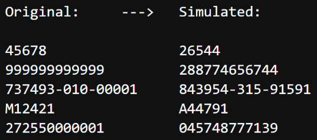
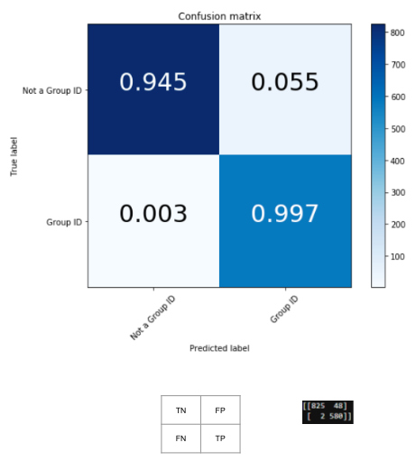
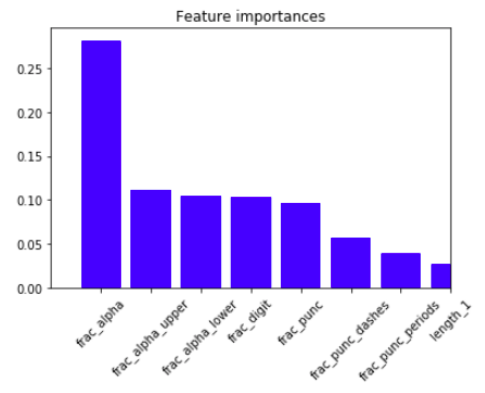
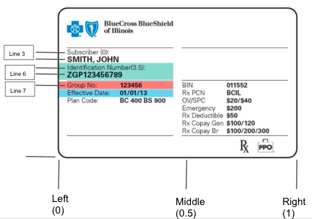
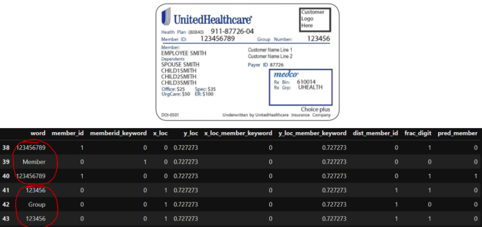
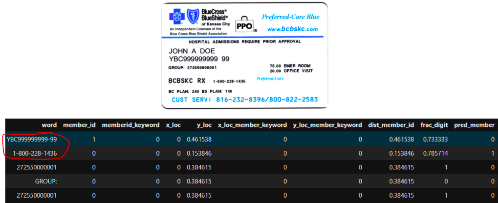

# Classifying-Insurance-Card-Text
A machine learning project to identify names, Group IDs, and Member IDs from insurance cards.

# Business Problem
Patients scan their insurance card at the clinic, but the administrative assisstant still must manually enter insurance information into the computer. This manual data entry costs time for the clinic and lowers the patient experience. If we could automatically extract information from the scanned insurance card, we could avoid time and frsutrated from manual entry.

# Solution
I build a text classifier to identify which words on an insurance card were the 1) member name, 2) Member ID, and 3) Group number.

# Data
The company who builds the scanners do not save the scanned text, because it would violate health privacy laws. So we had to produce insurance cards ourselves. We found about five real cards and 20 generic cards from online. The company extracted text using OCR software, then I took the resulting XML and extracted the words from the card.

I then hand-labelled every word as 1) member name, 2) group ID, 3) member ID, or 4) none. The classes were heavily imbalanced; there's only one name on every hard and a couple hundred other words. To overcome class imbalance, I simulated new Group IDs:
* letter -> random letter
* digit -> random digit
* punctuation -> same

The resulting simulated words looked similar, just with different digits/letters.

I also simulated names, using a list of most-common names I found online. This balanced the classes, even though most of the data was now simulated.

# Modeling
I ran a random forest using 60/40 stratified splitting, to keep the classes balanced. Here is the test set performance:

I also measured the feature importances to see which features were highly predictive:

The fraction of alphabetic features was the most predictive, while the length was not predictive.

## Take-2
Next, I changed to multiclass classification to predict 1) group ID, 2) member ID, 3) none. I also added in an indicator variable for whether the word was a "keyword", such as "Member" or "Group". The results are shown below, broken down by simulated and real data:

The results seem mostly good, with only few off-diagonals.

Now, length becomes a very important feature:

# Text-based features
I engineered 10 text-based features to represent each word:
1. Length of word
2. Fraction of characters that are letters
3. Fraction of characters that are digits
4. Fraction of alphabetic characters that are uppercase
5. Fraction of alphabetric characters that are lowercase
6. Fraction of digits that are puncuation (.,:)
7. Fraction of digits that are punctuation that are periods
8. Fraction of digits that are punctuation that are dashes

# Location features
We can use location information as features to identify Group numbers and others. For example, Group numbers often sit next to text saying "Group No.:". We encode location feautures manually; the vertical location is the line number, normalized to range one, and the horizontal location left/middle/right (0/0.5/1):

Instead of using a machine learning model with location as features, we instead use a simple logic algorithm:
* Iteration through words.
* If the word is a keyword (e.g. _Member_ is a keyword for Member IDs), measure the distance to every other word.
  * Iterate through the other words, starting with the closest word.
    * If the word is more than 50% digits and longer than three characters, predict it as a Member ID (or Group ID). This is because IDs are typically longer than 3 characters and have many numbers and few letters.

# Results
This simple algorithm correctly dientified 8 of 10 Member IDs and 7 of 10 Group IDs. The failures cases are all known cases where the assumptions of the algorithm failed:
* no group ID to find
* group ID had less than 50% digits
* no keyword on the card. Here's an example:

# Future word
This project gives a compelling proof-of-concept for automatic text entry. Indeed, some companies like Zocdoc have built models using CNNs to identify the group IDs when you scan the card on your phone. Another similar offering is Textract from Amazon, which scans an image and extracts key-value pairs. The approached used here, feature engineering and ML prediction, can serve as a good solution, especially if other commercial tools aren't flexible enough for this particular task. Further work should be done to engineer new features, refine the models, and deploy a model in production.